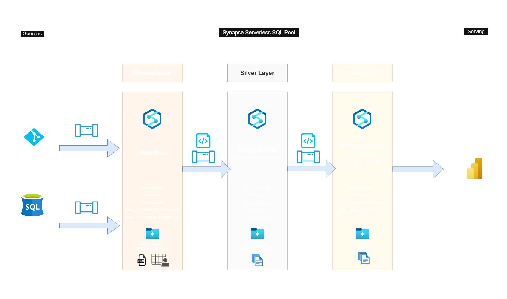
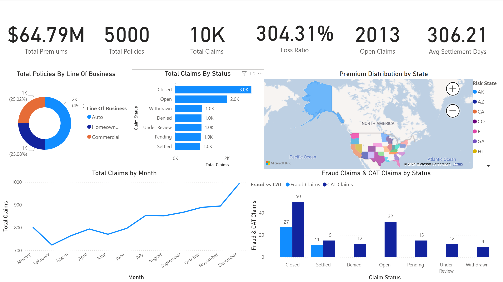
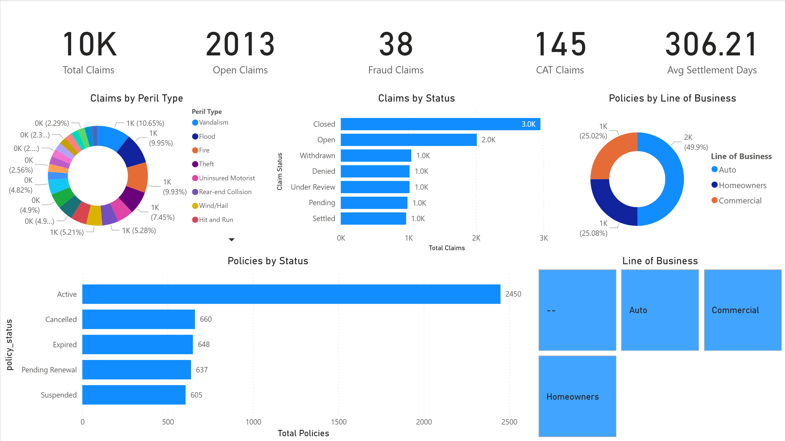

# P&C Insurance Data Pipeline

## Overview
End-to-end Azure Synapse Analytics data pipeline for Property & Casualty Insurance.
Implements a Medallion Architecture (Bronze → Silver → Gold) with incremental loading,
SCD Type 1 & 2, and a Power BI dashboard.

## Architecture



### Layer Summary

| Layer | Purpose | Storage | Format |
|---|---|---|---|
| **Sources** | On-Prem SQL Server + GitHub HTTP API | Local / GitHub | SQL Tables / JSON |
| **Bronze** | Raw data — no transformations | ADLS Gen2 | JSON + CSV |
| **Silver** | Cleaned, validated, deduplicated | ADLS Gen2 | Parquet |
| **Gold** | Star schema — business analytics ready | ADLS Gen2 | Parquet |
| **Serving** | Power BI Reporting | Power BI Service | DirectQuery / Import |

### Data Flow
```
Sources → Synapse Pipeline (Copy Activity) → Bronze (Raw)
Bronze  → Synapse Pipeline (Script Activity) → Silver (Cleaned)
Silver  → Synapse Pipeline (Script Activity) → Gold (Star Schema)
Gold    → Power BI → Dashboard
```

## Azure Resources
| Resource | Name |
|---|---|
| Resource Group | rg-pncinsurance |
| Storage Account | adlspncinsurance |
| Synapse Workspace | synapse-pncinsurance |
| Key Vault | kv-pncinsurance |
| SHIR | shir-pncinsurance |

## Source Data
| Source | Type | Rows | Load Pattern |
|---|---|---|---|
| customer.json | HTTP/GitHub | 2,023 | Full overwrite |
| agent.csv | On-Prem SQL | 200 | Full overwrite |
| coverage.csv | On-Prem SQL | 50 | Full overwrite |
| policy.csv | On-Prem SQL | 5,000 | Incremental |
| claims.csv | On-Prem SQL | 10,000 | Incremental |

## Pipelines
| Pipeline | Purpose |
|---|---|
| pl_ingest_http_bronze | Ingest customer.json from GitHub |
| pl_ingest_sql_bronze | Ingest 4 tables from on-prem SQL |
| pl_transform_silver | Validate + transform Bronze → Silver |
| pl_load_gold | Transform Silver → Gold (SCD) |
| pl_master | Orchestrates all pipelines |
| pl_init_silver | Reset Silver layer |
| pl_init_gold | Reset Gold layer |

## Environment Initialization
Before first pipeline run on any new environment:

1. Run on-prem SQL scripts:
   ```
   01_ddl_onprem.sql
   02_watermark_setup.sql
   ```

2. Run Silver setup in Synapse SQL:
   ```
   silver/01_silver_db_setup.sql
   ```

3. Run Gold setup in Synapse SQL:
   ```
   gold/01_gold_db_setup.sql
   ```

4. Run `pl_init_silver` pipeline
5. Run `pl_init_gold` pipeline
6. Run `pl_master` pipeline

## Watermark Tables
Silver watermarks stored in `dbo.pipeline_watermark` on on-prem SQL:

| table_name | last_load_date |
|---|---|
| customer | Bronze watermark |
| policy | Bronze watermark |
| claims | Bronze watermark |
| silver_customer | Silver watermark |
| silver_policy | Silver watermark |
| silver_claims | Silver watermark |

## Key Design Decisions

### Why Serverless SQL Pool?
- Pay per query — no dedicated pool costs
- No always-on compute charges
- Suitable for batch processing workloads

### Why Merge/Swap Pattern?
- Serverless SQL does not support MERGE statements
- CETAS fails if folder already exists
- Merge/swap ensures atomic updates

### Why SCD Type 2 for fact_claims?
- Claims can be reopened after closure
- Need full lifecycle tracking for actuarial analysis
- Enables loss development triangle calculations

### Why No Surrogate Keys?
- Serverless SQL does not support IDENTITY columns
- Natural business keys (customer_id, policy_id) are stable and unique
- In production, surrogate keys would be generated using dedicated pool

### Production Improvements
- Delta Lake for native MERGE, ACID transactions, time travel
- Gold layer watermarks for incremental SCD processing
- Logic App alerting for pipeline failures
- Surrogate keys using dedicated SQL pool

## SQL Scripts Structure
```
sql/
├── onprem/
│   ├── 01_ddl_onprem.sql
│   └── 02_watermark_setup.sql
│   └── 03_dml_onprem.sql
│   └── sp_silver_watermark_update.sql
│   └── sp_watermark_update.sql
├── silver/
│   ├── 01_silver_db_setup.sql
│   ├── 02_silver_coverage.sql
│   ├── 03_silver_agent.sql
│   ├── 04_silver_customer.sql
│   ├── 05_silver_policy.sql
│   ├── 06_silver_claims.sql
│   └── 07_bronze_validations.sql
└── gold/
    ├── 01_gold_db_setup.sql
    ├── 02_gold_ddl.sql
    └── 03_gold_transformations.sql
```

## Power BI Dashboard

### Page 1 — Executive Summary


| KPI | Value |
|---|---|
| Total Premiums | $64.79M |
| Total Policies | 5,000 |
| Total Claims | 10K |
| Loss Ratio | 304.31% |
| Open Claims | 2,013 |
| Avg Settlement Days | 306.21 |

**Visuals:** Total Policies by Line of Business, Total Claims by Status, Premium Distribution by State (map), Total Claims by Month, Fraud & CAT Claims by Status.

---

### Page 2 — Claims & Policy Analysis


| KPI | Value |
|---|---|
| Total Claims | 10K |
| Open Claims | 2,013 |
| Fraud Claims | 38 |
| CAT Claims | 145 |
| Avg Settlement Days | 306.21 |

**Visuals:** Claims by Peril Type, Claims by Status, Policies by Line of Business, Policies by Status.

> **Note on Loss Ratio (304.31%):** This reflects intentional data quality issues in source data — settlement amounts contain NULL/N/A values. In production this would be resolved through stricter Bronze validation.

## Data Quality Issues (Intentional)
| Table | Issue | Count |
|---|---|---|
| customer | Duplicate records | 23 |
| customer | Null phone numbers | ~110 |
| customer | Null zip codes | ~74 |
| customer | Invalid credit scores (N/A, unknown) | ~229 |
| claims | Orphaned claims (invalid policy_id) | 50 |
| claims | Claims on cancelled policies | 30 |
| claims | Null reserve amounts (N/A) | ~295 |
| policy | Invalid underwriting scores (N/A) | ~373 |
